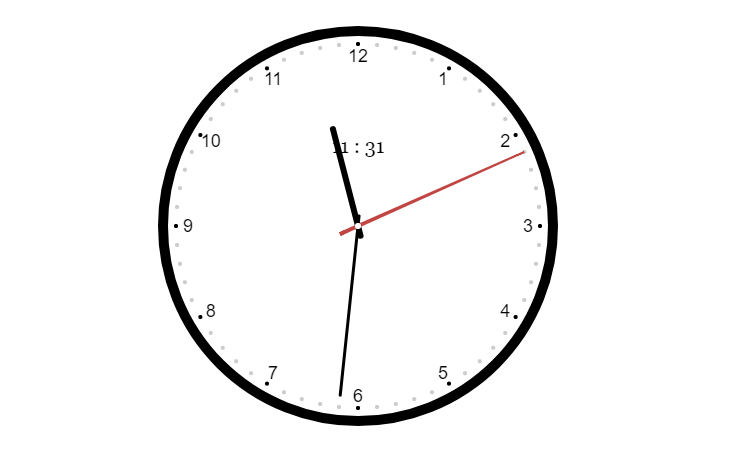

# canvas写个大金表



> HTML5 `<canvas>` 元素用于图形的绘制，通过脚本 (通常是JavaScript)来完成.`<canvas>` 标签只是图形容器，您必须使用脚本来绘制图形。你可以通过多种方法使用Canvas绘制路径,盒、圆、字符以及添加图像。
>
> 使用 `<canvas>` 元素不是非常难但你需要一些基本的[HTML](https://developer.mozilla.org/zh-CN/docs/HTML)和[JavaScript](https://developer.mozilla.org/zh-CN/docs/JavaScript)知识。`<canvas>` 元素不被一些老的浏览器所支持，但是所有的主流浏览器的新近版本都支持。Canvas 的默认大小为300像素×150像素（宽×高，像素的单位是px）。但是，可以使用HTML的高度和宽度属性来自定义Canvas 的尺寸。为了在 Canvas 上绘制图形，我们使用一个JavaScript上下文对象，它能动态创建图像（ creates graphics on the fly）

*关于canvas的入门知识，不在此讲解（去[MDN](https://developer.mozilla.org/zh-CN/docs/Web/API/Canvas_API/Tutorial)学习了解），这儿将介绍一个入门案例*

我们已经看见了这个钟，现在我们开始吧！！！

**这个大金表的关键自在于将时间值转为旋转角度（以弧度计）以及三角函数**
演示地址:[http://htmlpreview.github.io/?https://github.com/ogilhinn/canvasTutorial/blob/master/clock.html](http://htmlpreview.github.io/?https://github.com/ogilhinn/canvasTutorial/blob/master/clock.html)
GitHub地址：[https://github.com/ogilhinn/canvasTutorial](https://github.com/ogilhinn/canvasTutorial)

### 1. 基本HTML结构

```html
<!doctype html>
<html lang="zh-cn">
<head>
    <meta charset="UTF-8">
    <meta name="viewport"
          content="width=device-width, user-scalable=no, initial-scale=1.0, maximum-scale=1.0, minimum-scale=1.0">
    <meta http-equiv="X-UA-Compatible" content="ie=edge">
    <title>Canvas Clock</title>
    <style>
        div {
            margin-top: 80px;
            text-align: center;
        }
    </style>
</head>
<body>
<div>
    <canvas id="clock" width="400" height="400"></canvas>
</div>
</body>
</html>
```

### 2. 画表盘

```javascript
var clock = document.querySelector('#clock'),
    ctx = clock.getContext('2d'),
    height = ctx.canvas.height,
    width = ctx.canvas.width,
    r = width / 2

// 画表盘
function drawBackground() {
    ctx.save()
    ctx.translate(r, r)
    ctx.beginPath()
    ctx.lineWidth = 10
    ctx.arc(0, 0, r - 5, 0, 2 * Math.PI, false)
    ctx.stroke()

    var hourNum = [3, 4, 5, 6, 7, 8, 9, 10, 11, 12, 1, 2]
    ctx.font = '18px Arial'
    ctx.textAlign = 'center'
    ctx.textBaseline = 'middle'
    hourNum.forEach(function (num, i) {
        var rad = 2 * Math.PI / 12 * i
        var x = Math.cos(rad) * (r - 30),
            y = Math.sin(rad) * (r - 30)
        ctx.fillText(num, x, y)
    })

    for (var i = 0; i < 60; i++) {
        var rad = 2 * Math.PI / 60 * i,
            x = Math.cos(rad) * (r - 18),
            y = Math.sin(rad) * (r - 18)
        ctx.beginPath()
        if (i % 5 === 0) {
            ctx.fillStyle = '#000'
            ctx.arc(x, y, 2, 0, 2 * Math.PI, false)
        } else {
            ctx.fillStyle = '#ccc'
            ctx.arc(x, y, 2, 0, 2 * Math.PI, false)
        }
        ctx.fill()
    }
}
```

### 3. 画指针 

指针的关键在于，利用时间求出相应的弧度。`2π/12`就是每小时的弧度，每分钟的弧度与其同理

```javascript
function drawHour(hour, min) {
  ctx.save()
  ctx.beginPath()
  var rad = 2 * Math.PI / 12 * hour
  var mRad = 2 * Math.PI / 12 / 60 * min
  ctx.rotate(rad + mRad)
  ctx.lineWidth = 6
  ctx.lineCap = 'round'
  ctx.moveTo(0, 10)
  ctx.lineTo(0, -r / 2)
  ctx.stroke()
  ctx.restore()
}
```

这儿给出的时针的画法，其余指针与其同理

### 4. 表盘上的数字时间

```javascript
// 数字时间
function drawDateTime(hour, min) {
  if (hour < 10) hour = '0' + hour
  if (min < 10) min = '0' + min
  ctx.save()
  ctx.font = "20px Georgia"
  ctx.textAlign = 'center'
  ctx.textBaseline = 'middle'
  ctx.fillStyle = '#000'
  ctx.fillText(hour + ' : ' + min, 0, -80)
  ctx.restore()
}
```

### 5. 让指针走起来

```javascript
(function draw() {
  ctx.clearRect(0, 0, width, height)
  var now = new Date(),
      hour = now.getHours(),
      min = now.getMinutes(),
      sec = now.getSeconds()
  drawBackground()
  drawDateTime(hour, min)
  drawHour(hour, min)
  drawMin(min)
  drawSec(sec)
  drawDot()
  ctx.restore()
  setTimeout(draw, 500)
})()
```

至此，我们的大金表就大工告成